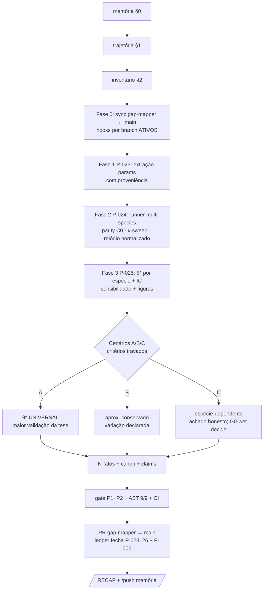

# PLAN PARTE 3 — Validação Cross-Species de θ\* (etrização, continuação)
## PLAN_DOC · 31/08 · branch-alvo: `gap-mapper` (worktree `../003-gap-mapper`) · guarda-chuva: pendência P-002

**Natureza:** PLANO de execução da PARTE 3 da tese — o complemento validatório ao que foi feito até aqui (Parte 1: design; Parte 2: etrização/ACP com estimador; **Parte 3: invariância multi-espécie do limiar θ\***). Base integral: `analysis/ACTION_PLAN_CROSS_SPECIES.md` (branch gap-mapper @e7a2976, diretriz da autora 30/08) + `GAP_MAPPER_V2_EXHAUSTIVE.md` (18 papers, GRADE) + `GAP_MAPPER_REPORT.md`. Este plano NÃO executa — decompõe, pré-registra critérios e garante hooks.

---

## §0 · MEMÓRIA DE CONTINUIDADE (onde está cada memória — ler nesta ordem ao retomar)

1. `guardian.md` (/RECAPs + decálogo) — história completa de sessões e regras
2. `AUDIT_CAPTURE_2026-08-30.md` — estado local×remoto auditado (D1-D9)
3. `PENDENCIAS.md` — ledger garantista (P-002 guarda-chuva; P-023..P-026 = esta Parte 3)
4. `paper/guardian/SKILL_SCOUT_S3_RATECOMPOSITION.md` — RELATE do P-001 (pré-requisito)
5. `../003-gap-mapper/analysis/{ACTION_PLAN_CROSS_SPECIES,GAP_MAPPER_V2_EXHAUSTIVE,GAP_MAPPER_REPORT}.md` — a base científica (branch gap-mapper)
6. `KNOWLEDGE_CANON.md` F-25/F-26/F-39/F-41 — predições travadas que NÃO se reescrevem
7. CI: workflows `ast-quality-gate` + `pdf-version-audit` (gated) — runs são o retorno mecânico

## §1 · TRAJETÓRIA (como chegamos a este plano — rastreável)

1. **F-39 (27/08):** sweeps exp{1,2}/C50/same-mass revelaram que o EXPOENTE é o discriminador e que a hierarquia é seed-mass-driven → θ\* passou a ser a quantidade central.
2. **Evolução 3 + C047 (28/08):** G0-sim declarado gate vigente (two-tier) — a validação computacional ganhou estatuto de continuidade.
3. **gap-mapper v1 (30/08 01:15, fdab839):** 4 parâmetros do modelo VALIDADOS por literatura independente (k_eff↔Corridon 2026 · Kd 71nM↔Chen 2010 · 2D↔Hrabe 2004 · difusão>fluxo↔Holter 2017).
4. **gap-mapper v2 (30/08 01:37, 3ba2f52):** 18 papers paper-a-paper (GRADE) → **8 VALIDAÇÕES independentes, 0 contradições não-resolvidas** (Sangeetham↔Gatdula resolvida por anchorless≠GPI; Parizek↔Corridon por contexto cultura≠in vivo) + gaps 1-7 mapeados.
5. **GAP-1 estrutural:** "se as proporções fragmentação/autocatálise/nucleação diferirem entre espécies, θ\* muda estruturalmente" — a maior ameaça restante à transferência murino→humano.
6. **Diretriz da autora (30/08 04:56, e7a2976):** inverter a fraqueza em teste — "o teste definitivo não é murino-humanizado, é a INVARIÂNCIA ENTRE ESPÉCIES" → ACTION_PLAN_CROSS_SPECIES nasce com hipótese central, Cenários A/B/C e protocolo de 4 fases.

**Hipótese central (H-P3):** θ\*≈0,333 é constante estrutural do método de contenção dominante-negativa, não artefato da parametrização murina.

## §2 · INVENTÁRIO DO QUE JÁ ESTÁ COLETADO

| Espécie | Kernel/relógio | Half-life PrP | Status de parametrização |
|---|---|---|---|
| Camundongo | Igel/Fornara 2024 (E009) completo | 5-6d (Corridon) | ✅ PRONTO (θ\*=0,333 travado v1.0) |
| Humano | Relógio Groveman 2019 (E007): 12,1d duplicação, 144d/unidade | 4,8-6,4d | ⚠ PARCIAL (taxas cinéticas relativas não publicadas — herda murinas) |
| Hamster | Telling 1995 + Castilla 2008 PMCA | — | 🔗 EXTRAÍVEL (taxas MAIS rápidas — dias-semanas) |
| Bank vole | Literatura emergente (ponte humano) | — | 🔗 EXTRAÍVEL |
| Rato | Dados limitados | — | 🔗 OUTLIER/NEGATIVO |
| Levedura | Taxas completamente publicadas (Asante menciona DN em yeast prions) | — | 🔗 COMPARATIVO (valida forma funcional) |

Parâmetros a extrair por espécie (Fase 1): K_autocat · K_frag · K_nucl · k_clear (~5d universal, Corridon) · [PrP^C]₀.
**8 validações independentes já colhidas** alimentam a validade da Base (V2 §matriz): k_eff, Kd, 2D, difusão, MV2=pior-caso (Walters 2022), forma funcional sem cofator (Geoghegan 2009), barreira de nucleação ~5× (Sabareesan 2017), transport-mecanismo.

## §3 · FASES E CRITÉRIOS PRÉ-REGISTRADOS (travados ANTES de qualquer run)

**Fase 0 — Sincronização do branch (pré-requisito de hooks):** merge `main`→`gap-mapper` (traz ledger PENDENCIAS.md + ast_check A9 + validators) → gates passam a valer POR BRANCH. Sem isso, o hook é vermelho por design (força de reconciliação, não punição).

**Fase 1 — Extração de parâmetros (P-023):** para cada espécie, extrair K_autocat/K_frag/K_nucl/k_clear/[PrP^C]₀ COM proveniência (identifier de fonte aberta; regra: número de fonte, nunca digitado de memória). Registra em `experiments/xspecies/species_params.json` + fontes candidatas a E-registry (Corridon 2026 → E039+ conforme ação #4 do V2). **Critério F1:** cada parâmetro com fonte citável OU declarado unavailable (não se inventa).

**Fase 2 — Runner multi-species (P-024):** `experiments/ws_9_multispecies.py` — motor v4 EXATO intocado (contrato do S1/S3), parametrização por espécie via JSON da Fase 1; κ-sweep {1.5, 2, 3, 4, 8}; normalização do relógio por espécie (a lição do §3 do scout S3); parity self-test embutido (camundongo deve reproduzir θ\*=0,333 — **C0: falhou = run inteiro rejeitado**). Saída: `experiments/xspecies/ws_9_multispecies_{species}.json` (+ rerun de reprodução).

**Fase 3 — Análise comparativa (P-025):** θ\* por espécie · barras com IC · teste de indistinguibilidade · se variar → decompor QUAIS taxas causam (sensibilidade) · figura auditável matplotlib-do-JSON.

**Fase 4 — Síntese e gates (P-026):** veredito pelo critério travado (abaixo) → N-fatos + canon F-43/F-44 + claims com binding → gate P1+P2 + AST 9/9 → merge `gap-mapper`→`main` via PR (CI obrigatório) → /RECAP.

**CRITÉRIOS DE VEREDITO (pré-registrados; extraídos verbatim do ACTION_PLAN — são eles que decidem, o resultado apenas os lê):**
- **Cenário A (validação máxima):** θ\* ≈ 0,333 em TODAS as espécies → "θ\* universal" — transforma a maior limitação ("taxas murinas") na maior validação ("demonstração computacional multi-espécie").
- **Cenário B (parcial):** θ\* varia dentro de 0,1-0,5 (mesma ordem de grandeza) → aproximadamente conservado; variação atribuída e declarada; MV2-calibrado = caso conservador.
- **Cenário C (invalidação):** θ\* varia >2× entre espécies → espécie-dependente; reportado honestamente; G0-wet permanece o único teste definitivo; a variação em si é achado (identifica parâmetros controladores).
- **C0 (paridade):** baseline camundongo ≠ v4 → NADA colhido; debug + re-run.
- **Anti-hindsight:** θ\*=0,333 (release v1.0) compara-se, nunca se retreina; toda comparação cita a âncora do release.

**Sequenciamento:** P-001 (S3 composição ±50%) ANTES — o braço N (escala uniforme) do S3 é o controle nulo que conecta diretamente ao teste de espécies (perturbação de espécie ≈ escala+composição).

## §4 · TODO-LIST × SKILLS SCIENTIFIC-\* (controle de task com dono e gate)

| Task-ID | Descrição | Skill regente | Gate que fecha | Status |
|---|---|---|---|---|
| P-023 | Extração de parâmetros por espécie com proveniência (+elevação Corridon→E039+) | paper-lookup + scientific-writing (binding; identifier só de fonte aberta) | A4/A8 no AST + JSON F1-criterado | PLANEJADA |
| P-024 | `ws_9_multispecies.py` (motor intocado, parity C0, κ-sweep, normalização de relógio) | test-driven-development + code-review-and-quality + uncertainty-and-units | C0 no runner + A9 (commit) | PLANEJADA |
| P-025 | θ\* por espécie + IC + decomposição de sensibilidade + figuras dos JSONs | scientific-visualization (matplotlib-auditável) + statistical-analysis | N-fatos + canon | PLANEJADA |
| P-026 | Síntese A/B/C + N-fatos/claims + gate + PR merge + /RECAP | scientific-writing + scientific-critical-thinking (veredito pelo critério, não pelo desejo) | guardian P1+P2 + AST 9/9 + CI no PR | PLANEJADA |

(Cada linha espelha o ledger `PENDENCIAS.md` P-023..P-026 — fonte única de contagem; o A9 bloqueia commit se perder a deferação `{{DEFER:...}}`.)

## §5 · HOOKS/GATES CI-CD POR BRANCH-COMMIT (retorno e controle de task)

1. **Por branch:** `ast-quality-gate.yml` dispara em push para `main` **e** `gap-mapper`/`executor`/`otimizacao-pqms-batch1`. Branch sem ledger/A9 = gate VERMELHO até reconciliar com main — força a Fase 0 (documentado; não é bug, é o gancho garantista).
2. **Por commit:** pre-commit local (A2-A9) + gate CI no push — nenhum commit de resultado escapa de: JSON-only → N-fatos → canon → gate → ledger.
3. **Retorno (feedback):** runs do CI (verde/vermelho visíveis por commit) + artifact `ast-report` com o ledger A9 por run + `/RECAP` por sessão + bot-commit do PDF versionado (pipeline gated: PDF só nasce sob AST VERDE).
4. **Controle de task:** `PENDENCIAS.md` é o single-source — cada fase fecha movendo a linha (PLANEJADA→EM_EXECUCAO→FECHADA com evidência); o A9 impede: evidência inexistente, marcador órfão, contagem drift, planejada-sem-defer.
5. **Merge:** só via PR para main com CI obrigatório (review da autora quando tocar superfície gated).

## §6 · MAPA DE FLUXO

## §7 · Regras de ouro herdadas
É simulação e é dito que é (tier [SIM] em toda saída) · locked-stays-locked (θ\* v1.0) · número só de JSON/registro · resolver pendência = remover marcador + fechar linha no ledger · sessão sem /RECAP não fechou · ciclo sem AST não fechou.
