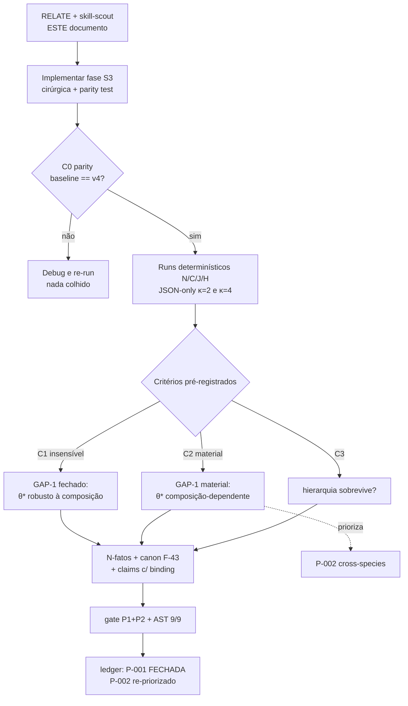

# SKILL-SCOUT S3 — Sweep de Composição de Taxas (P-001) + ponte P-002
## PLAN_DOC · 30/08 · RELATE formal do Protocolo de Ciclo (nada abaixo foi executado ainda)

**Objeto:** execução futura da pendência **P-001** (sweep ±50% na composição de taxas do kernel — fecha GAP-1 do gap-mapper) e sua conexão estrutural com **P-002** (invariância de θ\* entre espécies). Este documento declara O QUÊ, O PRODUTO, O COMO e OS CRITÉRIOS **antes** do primeiro run — anti-hindsight por construção (a predição travada v1.0 θ\*=0,333 é comparada, nunca reescrita).

---

## §1 · O QUE ESTÁ SENDO FEITO (escopo exato)

Interrogar se **θ\*=0,333 e a contenção κ=2 (raio 0,82 mm) são robustos à composição interna das taxas do kernel murino** — ou se dependem das proporções específicas Kt/Kr/Kc do Igel 2024. É o GAP-1 do `GAP_MAPPER_REPORT.md`: "se as proporções fragmentação/autocatálise/nucleação diferirem entre espécies, o θ\* muda estruturalmente". Nada além de [SIM]; nenhum claim migra para manuscrito sem gate.

## §2 · O QUE SERÁ PRODUZIDO (entregáveis verificáveis)

| # | Artefato | Regra de proveniência |
|---|---|---|
| 1 | `experiments/ws_9_v5_sweeps_gha.py` fase **S3** (extensão cirúrgica, motor v4 EXATO intocado) | diff mínimo; parity self-test embutido (baseline deve reproduzir v4: final_R_mm≈2,83 · 144 d/unidade — como o S1 fez) |
| 2 | `experiments/ws_9_results/ws_9_v5_sweeps_S3.json` (+ `*_rerun.json` se reprodução exigida) | número só do run (nunca digitado) — regra §3.4 |
| 3 | N-fatos novos no `consistency_manifest.json` + linha F-43 no `KNOWLEDGE_CANON.md` com binding | skill scientific-writing (evidence-binding) |
| 4 | Atualizações: `PENDENCIAS.md` (P-001 → FECHADA; P-002 re-priorizado se C2 disparar) + `/RECAP` | ciclo fechado só com AST 9/9 |
| 5 | Figura auditável (matplotlib lendo o JSON) — **se** o resultado pedir figura | decisão de rastreabilidade mantida (SKILL_SCOUT_PARTE2 §A) |

## §3 · COMO (desenho experimental do sweep — uma-factor + braço-null)

**Famílias de perturbação (9+3 runs, κ=2; subconjunto κ=4 p/ hierarquia):**

| Braço | Perturbação | O que testa |
|---|---|---|
| **N (null)** | escala uniforme ×0,5 e ×2,0 em Kt,Kr,Kc (razões preservadas) | **controle negativo elegante**: se θ\* é dimensionalmente estrutural, mudança de relógio global NÃO deve movê-lo (conexão direta com P-002: espécies ≈ mistura escala+composição) |
| **C (composição)** | cada classe isolada ×0,5 e ×2,0 (Kt·, Kr·, Kc· ⇒ 6 braços) | sensibilidade às RAZÕES entre classes (a questão do GAP-1) |
| **J (worst-case)** | classes dominantes conjuntas ±50% na direção anti-contenção | envelope de robustez |
| **H (hierarquia)** | melhor/pior braço re-rodado com seed-mass MV2×(126/1) | a hierarquia MV2>MV1 sobrevive à perturbação? |

**Métricas por run:** `final_R_mm` (κ=2) · `days_per_simunit` (re-normalização do relógio: perturbação de taxa muda o clock — comparação só após normalização temporal, senão o confound do relógio contamina o veredito) · massa total · upregulação · hierarquia seed-mass. **Confounds declarados:** (i) mudança de taxa muda o relógio → reportar θ\*-equivalente pós-normalização; (ii) grid 96×96 fixo (limitação κ×50 do canon F-29 inalterada).

## §4 · CRITÉRIOS DE ACEITAÇÃO (pré-registrados ANTES do run — são eles que decidem)

| ID | Critério | Veredito que produz |
|---|---|---|
| **C1** | Todos os braços N e C mantêm contenção κ=2 com variação de raio <10% do baseline 0,82 mm | **GAP-1 FECHADO-como-insensível** (análogo ao C50×10): θ\* robusto à composição; P-002 vira confirmação barata |
| **C2** | Algum braço C/J rompe a contenção em κ=2 (raio ≥2× baseline ou escape) OU desloca θ\*-equivalente >2× | **GAP-1 MATERIAL**: θ\* composição-dependente → P-002 sobe para prioridade-1 (e A6-wet fica ainda mais discriminador) |
| **C3** | Hierarquia MV2>MV1 (seed-mass) preservada nos braços extremos | consistência emergente não é artefato das razões específicas |
| **C0** | Parity self-test falha (baseline ≠ v4) | **RUN INTEGRAL REJEITADO** — nada é colhido; debug e re-run (skill debugging) |

Anti-hindsight: toda comparação cita o release onde θ\*=0,333 foi travado (v1.0); o sweep compara, nunca retreina (REPARAM_LOOP §4).

## §5 · SCOUT-SKILL deste ciclo (taxonomia do SKILL_SCOUT_PARTE2: ✓ aplicada · ◊ coberta por artefato · ○ fora de escopo)

| Skill | Estado | Papel neste ciclo |
|---|---|---|
| **scientific-critical-thinking** | ✓ | reflexão crítica pré-run: falsificadores C0-C3, confounds (relógio, grid), adversarial review do desenho antes de codificar |
| **hypothesis-generation** | ✓ | formaliza H-S3 ("θ\* é invariante a perturbações de composição ±50%") com predições discriminantes por braço — o que cada família de braços exclui |
| **uncertainty-and-units** | ✓ | auditoria dimensional (razões de taxas adimensionais; normalização temporal pós-perturbação; envelope ±50% como incerteza Tipo-B estrutural) |
| **experimental-design** | ✓ | o desenho N/C/J/H É um DOE: null-control + one-factor + worst-case + bloco de hierarquia |
| **test-driven-development** | ✓ | parity self-test C0 embutido no runner (o S1 estabeleceu o precedente); nenhuma colheita sem o teste passar |
| **code-review-and-quality / doubt-driven** | ✓ | revisão adversarial do diff antes do run (mudança cirúrgica no estilo E-07/fs_exp: motor intocado, só parametrização) |
| **scientific-writing** | ✓ (núcleo) | N-fatos + claims com binding; número só de JSON; validadores A4/A7/A8 no fechamento |
| **markdown-mermaid-writing** | ✓ | mapa de fluxo do ciclo (§6) — documentação como diagrama |
| **scientific-visualization** | ◊ | geração própria por matplotlib-auditável dos JSONs (decisão de rastreabilidade mantida) |
| **statistical-analysis/power** | ◊ | sim determinística não exige inferência; envelope/intervalos já definidos pelos braços |
| **observability / planning** | ◊ | contrato JSON-only e ledger P-001 já cobrem |
| **debugging-and-error-recovery** | ✓ standby | se C0 disparar ou solver divergir (Early-stop EXTINÇÃO já instrumentado no motor) |
| sims ômicas / bibliômicas / clínicas | ○ | fora do escopo deste ciclo (declarado, não pendência) |

**Seleção mínima para EXECUTE:** critical-thinking + hypothesis-generation + experimental-design + uncertainty-and-units (desenho) → TDD + code-review (implementação) → scientific-writing + mermaid (registro) → AST A9 (garantia).

## §6 · MAPA DE FLUXO do ciclo (mermaid)

## §7 · Protocolo

Ciclo `RELATE (este doc) → EXECUTE (S3) → AST (9/9 + gate)`; sessão termina com `/RECAP` (guardian.md + session-state). Qualquer desvio do §3/§4 durante a execução = emenda versionada com justificativa ANTES de colher (decálogo 9).
