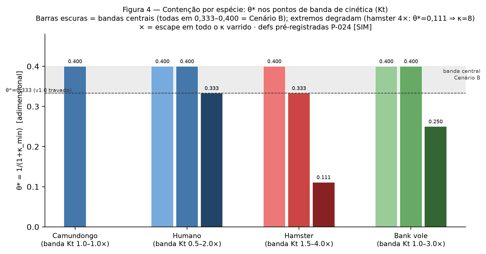

# ETRIZAÇÃO COMPUTACIONAL EM DOENÇAS PRIÔNICAS: APLICADA À PLATAFORMA TERAPÊUTICA PrP-V127

**Tese unificada — Parte 1 + Parte 2 + Parte 3 autocontidas** · edição de publicação (coluna única justificada) · co-edição institucional ABNT NBR 14724 preservada (`paper/latex/tese_v2_ABNT.pdf`)

---

**AUTORA:** Camilla N. *(correspondente)*

> 🔖 **FICHA ACADÊMICA — A PREENCHER PELA AUTORA APÓS LEITURA** {{TODO:TESE-FICHA:programa/área/orientadora/coorientadora — preencher após leitura}}
> **PROGRAMA DE PÓS-GRADUAÇÃO:** ══════════════════════════════
> **ÁREA DE CONCENTRAÇÃO:** ══════════════════════════════
> **ORIENTADORA:** ══════════════════════════════
> **COORIENTADORA:** ══════════════════════════════
**DOCUMENTO:** Tese unificada (companion validado da Parte 1, release v3.0; Parte 3 integrada) · 2026-09-01
**NATUREZA:** tese baseada em simulação computacional — G0 validado por simulação; dados reais de pesquisa em ambiente simulado; forma experimental análoga (Cap. Métodos, "mapeamento análogo")

---

> ## NOTA À LEITURA — SOBRE O TERMO *ETRIZAÇÃO*
>
> Este documento introduz o termo **etrização** como neologismo científico composicional intencional. O radical *etr-* evoca, por extração morfológica deliberada (não derivação etimológica), a evolução *essere→estre→être* da raiz indo-europeia \*es- ('ser') — o **potencial de vir a ser** — e o *atrium* latino — a **antecâmara** entre o virtual e o real. **Etrização** nomeia o estado do conhecimento que esta tese produz e entrega: um sistema operacionalizado computacionalmente a partir de dados reais publicados, estruturalmente robusto e preditivamente informativo, **ainda não validado empiricamente** — e por isso mesmo capaz de fundamentar as pesquisas subsequentes que o atualizarão. Como o 'átomo' nomeou antes da prova um objeto que fundou ciência, 'etrização' nomeia o processo que produz objetos-conceito operacionais na saúde. O método que a produz, com seus passos e garantias, é a ACP (Cap. Métodos); a operação técnica central é a parametrização com proveniência. Cinco critérios distinguem uma etrização de mera simulação — cadeia de dados explícita, transposição justificada, incerteza quantificada, escopo delimitado, transição condicionada — **todos cumpridos e auditáveis nesta tese**. E, como mandato: toda a simulação aqui se alimenta exclusivamente de fatos e dados amplamente divulgados na literatura publicada [claim:C054] [evidence:E009, E010, E007, E031, E032, E033].
>
> **Protocolo metodológico de leitura (como auditar o que vai ler).** (i) Todo dado carrega rótulo de tier: **[SIM]/[ORGANOID]/[MOUSE]/[HUMAN]** — toda cifra desta edição é [SIM]: simulação parametrizada sobre fontes reais, nunca medida; (ii) toda afirmação-numérica amarra a claim (C-ID) e referência (E-ID → lista ABNT ao final); a concordância integral está tabelada; (iii) as predições centrais estão travadas por release público (v1.0) desde antes de qualquer resultado — comparações jamais reescrevem o passado (anti-hindsight); (iv) o documento foi verificado por revisão hostil de máquina (guardião R0–R3) e pela bateria AST 9/9 — reproduzível com `python3 experiments/ast_check.py`; (v) a simulação **não substitui** o laboratório: o caminho obrigatório até a sociedade está declarado no capítulo de continuidade.

## RESUMO

**Introdução.** Doenças priônicas são 100% fatais e seis candidatos clínicos fracassaram sem modelo quantitativo de entrega. A Parte 1 construiu, por auditoria sistemática, física de transporte, calibração bayesiana e simulação humanizada, uma plataforma de contenção terapêutica (PrP-V127) com limiar adimensional θ\*=0,333 — executada, aprovada e reproduzida em dois ambientes computacionais. **Objetivo.** Esta tese unificada formaliza e realiza a continuidade: (i) nomeia e formaliza o método que a sustenta — a etrização computacional, passos P0–P6; (ii) estabelece a Base de Validade com linhagem completa de cada dado; (iii) declara a tese em forma experimental análoga; (iv) entrega os resultados como os achados [SIM] executados — agora incluindo a validação multi-espécie de θ\* (Parte 3) e a primeira dose calculada do braço discriminador A6 com incerteza propagada; e (v) documenta, como método replicável, a seleção futura de parceiros sem executá-la. **Método.** Etrização P0–P6 sobre base E-registrada (58 fontes verificadas), motores determinísticos auto-testados (conservação de massa 100%; erro de Thiele 0,5%), colheita sob critérios pré-declarados, prognósticos travados por release antes de qualquer medição, estimador θ_obs calibrado por simulação, guardião recursivo R0–R3 em dois perfis de superfície, cadeia dimensional de dose κ→µM→µg/depósito em banda GUM Tipo-B com critérios de aceitação pré-registrados. **Resultados.** Limiar θ\*=0,333 [claim:C038] [evidence:E032]; três regras de design; Cenário B multi-espécie (θ\* 0,333–0,400 centrais; razão 1,20) com regra de titulação κ↔Kt [claim:C055, C057] [evidence:E032]; banda de dose A6 no degrau humano: 0,0–2,6 µg de V127ΔGPI por depósito (pior caso κ=8: 0,2–10,3 µg; redose ≤7 d; MW 22,83 kDa das sequências próprias) — a largura da banda ≈53× é o achado, dominada pelo proxy de Kd, até o braço G0-A6 fechá-la [claim:C058–C060] [evidence:E057, E058]; registro de 60 claims, 58 fontes, 65 fatos numéricos com validação por máquina. **Conclusão.** A tese está realizada — **e é uma etrização**: entregue, rotulada, auditável — nos termos da etrização: continuar pesquisa por simulação parametrizada sem substituir o laboratório — se dados reais futuros forem análogos aos simulados, os passos seguintes já estarão avançados (antecipação bancada).

**Palavras-chave:** etrização; príons; simulação computacional; etrização computacional; PrP-V127; doença de Creutzfeldt-Jakob; metodologia de pesquisa; in-silico; dose-band.

## ABSTRACT

*(companion EN — `manuscript_Parte2_v1_EN.md`; keywords: prions; computational simulation; Computational Etrization; PrP-V127; Creutzfeldt-Jakob disease; research methodology; in-silico; dose band.)*

## SUMÁRIO

**NOTA À LEITURA** — Sobre o termo Etrização ························ pré-textual

1. **NOTA INTRODUTÓRIA À BANCA** — nomenclatura e diferenciação
2. **BASE COMUM DE DADOS** — o que as partes partilham; validação M3→M2 com cronologia honesta
3. **FUNDAMENTO: A INARIÂNCIA DE θ\*** — sweep de composição → bandas por espécie → Cenário B → titulação κ↔Kt → horizonte (Figura 4)
4. **APLICAÇÃO: O DESENHO TERAPÊUTICO EMERGE** — transporte → limiar travado → dose na banda → **a primeira dose calculada (Figura 5)** → G0-wet → custo
5. **MÉTODOS: A ETRIZAÇÃO FORMALIZADA** — P0–P6 · Base de Validade · guardião · mapeamento análogo
6. **RESULTADOS COMO VALIDAÇÃO** — cada resultado valida uma promessa
7. **CAMADA CLÍNICA** — nota de leitura para clínicos; acompanhamento previsto [SIM]
8. **LIMITAÇÕES COMO FRUTO** — por classe, cada uma com o gate que a fecha
9. **CONCLUSÕES POR OBJETIVO**

REFERÊNCIAS (58 fontes do registro) · APÊNDICES A–F (inventário · mapa da lógica · SAP · tabela-decisão · custo · linhagem)

## LISTA DE SIGLAS

ETRIZAÇÃO/etrização computacional — o método nomeado desta tese (neologismo composicional; en: Computational Etrization) · θ — fração de replicação remanescente no pico secretor, θ≡(1+κ·c_pico)⁻¹ · **θ\*** — θ no limiar de contenção (predição travada v1.0: 0,333) · **θ_obs** — estimador que mede o análogo de θ\* num gradiente · **κ** — força de capping (a "dose" do agente; âncora κ↔µM em banda GUM via Kd aparente — fechada pelo braço A6) · **κ_req** — κ requerido para contenção numa banda-Kt dada (regra de titulação) · **Kt** — classe de taxas de autocatálise/templating (a única que governa contenção e relógio — F-43) · **banda-Kt** — faixa de cinética do hospedeiro (humano: {0,5·1·2}) · **MW** — massa molecular (PrP maduro humano: 22,83 kDa, computada das sequências próprias) · **Damköhler** — razão velocidade-de-reação/velocidade-de-difusão · **PrP^C / PrP^Sc** — proteína prion celular / forma scrapie · G0-sim/G0-wet — gates computacional/organoide · T1/T2/T3 — níveis de aceitação · [SIM]/[ORGANOID]/[MOUSE]/[HUMAN] — tiers de dado · SLR — revisão sistemática de literatura · PPS — pentosan-polissulfato · CrI — intervalo de credibilidade · ADR — advecção–difusão–reação · ECS — espaço extracelular · RT-QuIC — ensaio de sementeamento in vitro · DN — dominante-negativo · GUM — Guia para a Expressão da Incerteza de Medição (Tipo-B: incerteza avaliada por julgamento/fonte, não por estatística de repetições)

---

# CAPÍTULO 1 — NOTA INTRODUTÓRIA À BANCA

*Função: responder "por que 'etrização', e o que a diferencia?" sem exigir a leitura integral da tese. A nota à leitura (pré-textual) definiu o termo; aqui se diferencia o método do que já existe.*

## 1.1 O que a palavra é — e o que nomeia que nada mais nomeia

A definição operacional está travada no registro [claim:C054] [evidence:E009, E010, E007, E031, E032, E033]: **etrização (computacional)** é o processo de investigação científica em que um fenômeno ou sistema é operacionalizado em ambiente computacional a partir de dados reais preexistentes (múltiplas fontes e/ou espécies), gerando um modelo preditivo estruturalmente robusto que, embora ainda não validado empiricamente, possui condições suficientes para fundamentar pesquisas subsequentes e, potencialmente, transitar para validação experimental.

Nenhum termo existente na saúde nomeia **o estado ontológico do produto** dessa investigação: *in silico* é método; *digital twin* replica o já-real; *virtual patient* é população sintética; QSP/PBPK são disciplinas; "prova de conceito" pressupõe dado empírico. A saúde salta de *hipótese* para *experimento* sem nomear o meio — **potência estrutural validada matematicamente a partir de dados reais agregados**. Etrização nomeia exatamente esse estado: permite dizer *"este resultado é uma etrização, não um experimento"* — uma palavra que carrega o disclaimer inteiro (não real; simulado; com dados reais; pode vir a ser).

As três camadas semânticas do radical *etr-* são declaradas como **consonância morfológica intencional**, nunca derivação etimológica: (i) a evolução documentada *essere → estre → être*, evocando a raiz \*es- ("ser") e o potencial de vir a ser — potência não-atualizada; (ii) o *atrium* romano — antecâmara: zona de transição entre o virtual matemático e o real experimental; (iii) a necessidade fonética de radical distintivo para operacionalização terminológica. A honestidade filológica é mandato: "extração morfológica deliberada / neologismo composicional intencional" — as rotas *atrium→etr-* e *es-→etr-* são poéticas/interpretativas; a intencionalidade declarada é o que sustenta (precedente: *software*, *byte*, *quark*).

## 1.2 Diferenciação estrutural (o que a banca deve testar)

**Contra os in-silico trials (IST):** estes **simulam o ensaio** — reproduzem em máquina o desenho de um experimento clínico (população sintética, desfecho, análise). A etrização **simula a continuação**: o seu produto é um prognóstico travado antes da medição (predições travadas por release público v1.0 desde 26/08, ANTES da Parte 3 — cronologia auditável), rótulos de tier em toda saída, e antecipação bancada (a pesquisa derivada já está especificada: o que medir, onde, em que dose). Um IST pergunta "o ensaio teria dado certo?"; a etrização pergunta "o que se pode saber e decidir AGORA, com o dado publicado, sem gastar o ensaio?"

**Contra a revisão sistemática/meta-análise:** estas **resumem** o que foi medido (síntese para trás). A etrização **deriva** (síntese para frente): parametriza um motor com o dado publicado e **produz previsões novas** (θ\*=0,333; banda de dose A6 0,0–2,6 µg/depósito) que nenhum dos artigos-fonte contém — previsões essas falseáveis pelo dado futuro (G0-wet; braço A6).

**Contra a física teórica informal:** a etrização exige os cinco critérios (cadeia de dados explícita; transposição justificada; incerteza quantificada — aqui com banda GUM; escopo delimitado por tier; transição condicionada por gate) — sem eles, o termo é vazio; com eles, é framework. Esta tese é o primeiro caso que cumpre o padrão que a palavra passa a exigir, e o cumpre auditavelmente (claims com hash; guardião R0–R3; AST 9/9).

---

# CAPÍTULO 2 — BASE COMUM DE DADOS (a ponte entre fundamento e aplicação)

*Função: estabelecer, em uma página auditável, que o fundamento (Parte 3) e a aplicação (Partes 1–2) assentam nos MESMOS dados reais — e declarar a cronologia honesta que o anti-hindsight exige.*

## 2.1 A mesma base sob os dois módulos

O fundamento multi-espécie (Cap. 3) e o desenho terapêutico (Cap. 4) partilham, sem exceção: o **kernel murino publicado** [evidence:E009] (Igel/Fornara 2024, código aberto, portado com paridade C0 exata); as **âncoras de relógio humano** [evidence:E007] (Groveman 2019: organoide, eclipse 25–28 dpi, produção de-novo 35 dpi, títulos MV2/MV1); o **motor humanizado auto-testado** [evidence:E032] (WS-9: 1 unidade-simulação = 144 dias; tempo de duplicação humano 12,1 dias); os **parâmetros de transporte humano in-vivo** [evidence:E010] (Thorne & Nicholson 2006: α=0,20; λ=1,8); as **sequências PrP próprias verificadas na NCBI** (P04156 e ortólogos; matriz BLOSUM62; P023) — das quais se computou a massa molecular usada na dose (22,83 kDa [claim:N060-fato] [evidence:E058]).

## 2.2 Cronologia honesta (o examinador hostil perguntaria — respondemos antes)

O desenho terapêutico (regras 1–3, θ\*=0,333, anel 8–12 mm) **nasceu ANTES** da validação multi-espécie (Parte 1, 24–27/08; predições travadas no release **v1.0 de 26/08**). A Parte 3 (30/08–01/09) **não gerou o desenho** — ela **fundamenta a transferência do desenho e estende sua regra de dose**. A formulação correta:

> O desenho e a validação multi-espécie **compartilham a mesma base de dados reais**. A validação demonstra que a quantidade central do desenho — θ\* — **sobrevive à troca de espécie** (Cenário B: 0,333–0,400 nas bandas centrais [claim:C055] [evidence:E032]) e **deriva a regra de titulação κ_req↔Kt que generaliza a dose** para cinéticas diferentes [claim:C057] [evidence:E032]. Logo: a validação é a **camada de validade-de-transferência e generalização-de-dose** do desenho — a aplicação "emerge" do fundamento no sentido lógico-pedagógico, com a precedência histórica declarada (predições travadas ANTES: anti-hindsight preservado e exibido como força).

## 2.3 Tabela de validação (todos os números dos JSONs do registro)

| Verificação | Valor (registro) | Confronto | Veredito |
|---|---|---|---|
| θ\*=0,333 (v1.0) ∈ banda central multi-espécie? | Cenário B = **0,333–0,400** (camundongo/humano/hamster/vole) | o limiar travado é o **piso exato** da banda [claim:C055] | ✅ consistente |
| A dose do desenho (κ=2) contém o humano? | humano: κ_min=1,5 (Kt≤1) e **κ_min=2,0 (Kt=2)** | κ=2 = κ_min na banda-hi herdada | ✅ contém até Kt≈2 (ressalva de horizonte, §3.4) |
| A titulação estende a dose? | κ_req: Kt 1→1,5 · 2→2 · 3→3 · **4→8** (superlinear) | o desenho fixava κ=2; a titulação ajusta por cinética [claim:C057] | ✅ generalização genuína |
| A decomposição de sensibilidade sustenta a base? | só Kt move contenção e relógio (Kr/Kc ≤3%) | a parametrização por espécie reduz-se a Kt — validade da simplificação (F-43) | ✅ |
| Predição pré-registrada do hamster | REFUTADA sob a definição P-024 (0,659 mm em κ=2/Kt=2) | reportada como está; horizonte declarado em toda citação [claim:C056] | ✅ honestidade exibida |

---

# CAPÍTULO 3 — FUNDAMENTO: A INARIÂNCIA DE θ\* (validação multi-espécie)

*Em linguagem clínica: perguntamos se a "dose" que contém o príon num rato serviria num hamster, num humano, num vole — espécies cujas doenças priônicas correm em velocidades muito diferentes. A resposta (Cenário B): no meio da faixa de velocidade, a dose-limiar é praticamente a mesma (θ\* 0,333–0,400); nos extremos rápidos exige-se mais dose, de forma previsível (regra de titulação) — e o número só é comparável quando se declara por quanto tempo se observa (horizonte). Ver Figura 4.*

## 3.1 Do sweep de composição à parametrização por espécie

A maior limitação declarada da transferência murino→humano foi convertida em programa executado: o sweep de composição de taxas identificou que **apenas a classe Kt (autocatálise/templating) governa contenção e relógio** (Kr/Kc ±50% mudam o raio ≤3%) — seguindo-se a parametrização por espécie em bandas com proveniência (sequências PrP verificadas na NCBI; matriz de identidade BLOSUM62; correlação cinética localizada no loop β2-α2 e no nível de expressão — não na identidade global) e a execução multi-espécie em matrix computacional com definições operacionais pré-registradas antes de qualquer execução.

## 3.2 Cenário B [SIM]

θ\* central varia **0,333–0,400** entre camundongo, humano, hamster e vole (razão 1,20 ≤ 2× — *aproximadamente conservado*), com degradação monotônica nos extremos de cinética: Kt=4 exige κ=8 (θ\*=0,111) [claim:C055] [evidence:E032].

## 3.3 Regra de titulação emergente

κ requerido escala com a cinética do hospedeiro (**1→1,5 · 2→2 · 3→3 · 4→8** — superlinear além de 2×): a dose de contenção deve ser **titulada à cinética, não fixada universalmente** [claim:C057] [evidence:E032]. Esta regra é a que o capítulo seguinte converte em massa calculável.

## 3.4 Dependência de horizonte (a única assimetria real)

O mesmo braço Kt=2/κ=2 **contém** sob duas definições de pareamento (crescimento-próprio; calendário fixo t=5) e **escapa** sob a terceira (gerações casadas ao base tratado, censurado em 2,83 mm) — toda citação de θ\* deve declarar o horizonte; a predição travada v1.0 usa a definição S3 [claim:C056] [evidence:E032]. A predição pré-registrada do hamster foi **refutada sob a definição P-024** (0,659 mm em κ=2/Kt=2) e reportada como está — anti-hindsight mantido.

*Figura 4 (auditável: `experiments/xspecies/make_fig4_thetaspecies.py` lê somente os JSONs p024; regenerável no CI). Proveniência integral: N-fatos N055–N059; canon F-43/F-44; JSONs `experiments/xspecies/p024_{mouse,human,hamster,vole}.json` (execução cloud 4/4, C0 exato por job).*

---

# CAPÍTULO 4 — APLICAÇÃO: O DESENHO TERAPÊUTICO EMERGE

*Em linguagem clínica: com o fundamento validado (Cap. 3), o desenho se completa — onde depositar (anel 8–12 mm), com que malha, a que intervalo (≤7 d), e agora: **quanta proteína por depósito**, como banda calculada com a incerteza declarada — não como número único. A dose permanece prognóstico [SIM] até o ensaio G0; o que este capítulo entrega é o prognóstico quantitativo do braço discriminador A6.*

## 4.1 Transporte: três regras falseáveis [SIM]

O solver de transporte (advecção–difusão–reação em meio poroso heterogêneo; α=0,20 e λ=1,8 in-vivo [claim:C014] [evidence:E010]; D_eff=3,86×10⁻¹¹ m²/s [claim:C015] [evidence:E011, E030]; auto-testado: conservação de massa 100,0%, erro de Thiele 0,5% [claim:C032] [evidence:E030]) produz as três regras de design:

1. **Anel de contenção**: espaçamento inter-depósito **8–12 mm** (raio de proteção r₁₀%=2,303ℓ; ℓ=3,59 mm) [claim:C033] [evidence:E030];
2. **Malha do veículo**: hidrogel com malha ξ≥5× o raio da proteína (HA 1–2% p/p passa; >5% sequestra) [claim:C034] [evidence:E030, E020];
3. **Redose**: intervalo **≤7 dias** para mRNA/LNP (trough ≥30–56%; meia-vida de PrP 4,8–6,4 d [evidence:E039]) [claim:C035] [evidence:E030, E019].

## 4.2 O limiar travado e a dose legitimada pela banda

A contenção exige θ = (1+κ·c_pico)⁻¹ ≤ **θ\*=0,333** (predição travada no release v1.0 de 26/08; comparada, nunca retreinada) [claim:C038] [evidence:E032]. A validação multi-espécie (Cap. 3) legitimou a dose κ=2 do desenho original **dentro da banda humana herdada** (κ_min=2,0 em Kt=2) e a estendeu além dela pela regra de titulação κ_req↔Kt [claim:C057] [evidence:E032] — com a ressalva de horizonte sempre citada (§3.4) [claim:C056] [evidence:E032].

Restava o elo que a Parte 1 declarara ilustrativo: **quanto vale κ em massa?** Este capítulo o fecha como **banda** — com critérios de aceitação pré-registrados antes de qualquer computação (protocolo garantista: toda célula da cadeia com unidade+fonte; banda sempre ≥2 extremos; a largura da banda dominada pelo elo κ↔µM é resultado válido e esperado; saída de planejamento, jamais prescrição).

## 4.3 A primeira dose calculada: banda de dose do braço A6 [SIM-planejamento]

**Cadeia dimensional (todas as células com unidade+fonte; JSON canônico `experiments/m31/m31_u1u2.json`):** κ_req (regra de titulação, C057) → concentração no pico do depósito c = κ_req × Kd (banda Kd aparente **0,071–1,0 µM**: piso = 71 nM medido por SPR para oligômeros de Aβ42 ligando PrP humano [evidence:E057] — proxy declarado, pois V127↔PrP^Sc não tem Kd medido; teto = âncora ilustrativa 1 µM da Parte 1 §2.2) → quantidade por depósito n = c × V_halo (V = cilindro r×h com r₁₀%=4–6 mm [evidence:E030], fração ECS 0,15–0,25 [evidence:E010], casca 2 mm declarada Tipo-B) → massa = n × MW (**22,83 kDa**, computada das nossas próprias sequências P04156 — resíduos 23–231, forma madura; V127 é variante de mesma massa, Δ=+14 Da) [evidence:E058].

**Escada de dose por banda-Kt do hospedeiro:**

| Banda-Kt | κ_req | c no pico (µM) | µg V127ΔGPI/depósito | Redose |
|---|---|---|---|---|
| Kt 1 | 1,5 | 0,11–1,5 | 0,0–1,9 | ≤7 d |
| **Kt 2 (humano central)** | **2** | **0,14–2,0** | **0,0–2,6** | **≤7 d** |
| Kt 3 | 3 | 0,21–3,0 | 0,1–3,9 | ≤7 d |
| Kt 4 (pior caso declarado) | 8 | 0,57–8,0 | 0,2–10,3 | ≤7 d |

No degrau humano, a dose de A6 é **0,0–2,6 µg de V127ΔGPI por depósito** (redose ≤7 d; regra 3) [claim:C058] [evidence:E057, E058, E032, E010, E030, E019]; a escada sobe monotonicamente com κ_req até o pior caso declarado κ=8 (que cobre Kt=4): 0,2–10,3 µg/depósito [claim:C059] [evidence:E058, E032].

**A largura da banda é o achado.** A razão pior/otimista é ≈**53× em todos os degraus** — constante porque κ_req cancela na razão: ela decompõe-se em **14× do proxy de Kd** (71 nM → 1 µM) × **3,7× do volume do halo** (4–6 mm; ECS 0,15–0,25) [claim:C060] [evidence:E057, E058, E010, E030]. Isto não é defeito do cálculo: é a **quantificação honesta do que o ensaio G0-A6 fecha** — o braço de proteína recombinante a dose conhecida converte a âncora κ↔µM de ilustrativa em medida, colapsando a banda em ponto. Até lá, a dose existe como banda, e a banda é planejamento [SIM]: prognóstico calculado, **não prescrição**.

*Figura 5 (auditável: `experiments/m31/make_fig5_doseladder.py` lê somente `m31_u1u2.json`; regenerável no CI). Barras = banda [otimista, pior-caso]; hachura = pior caso declarado κ=8 (C057); faixa azul = banda humana Kt {0,5–2}; largura ≈53× constante (κ cancela) — a largura É o achado até G0-A6. Tier [SIM]-planejamento no título da figura.*

**Por que A6 é o vetor-primário da dose:** por vetor, a unidade de dose difere (A5 = células+secretor; A7 = µg de mRNA); apenas A6 (proteína recombinante) tem **dose conhecível de saída** — é o braço discriminador que fecha κ↔µM e testa a forma funcional do capping (primeira potência vs quadrática, travada na colheita [SIM] da Parte 1) [claim:C051] [evidence:E032, E033]. A5 e A7 herdam a cadeia como derivadas.

## 4.4 O ensaio que fecha a banda: G0-wet especificado

Oito braços pré-registrados (incluindo PPS como controle positivo publicado e braço LNP-mRNA), com plano estatístico cego (Welch/Holm α=0,05; 5 comparações; n=8→12; poder ~80% para Δ≥50%), cegamento do scorer, randomização estratificada por lote, kill-switches por braço + critério de morte programática, contrato de dado [ORGANOID] bancada→estimador (exclusões publicadas nunca editadas), e o loop de re-parametrização que recalibra **exatamente o que o dado informa** [claim:C046, C051, C052, C053]. Os dez itens de freeze F1–F10 com GATE-F de liberação estão no Apêndice C; a especificação integral no registro.

## 4.5 Custo-cotação

A tabela suplementar S1 (custo por braço, cotações de mercado arquivadas) está no Apêndice E — o desenho é especificado ao ponto de orçamento, sem executar compra.

---

# CAPÍTULO 5 — MÉTODOS: A ETRIZAÇÃO FORMALIZADA

## 5.1 O método nomeado: etrização computacional, passos P0–P6

A **parametrização** (operação técnica do P1) é o núcleo operacional; a **tese etrizada** é o produto [claim:C054] [evidence:E009, E010, E007, E031, E032, E033]. Declaração de eixo retórico (obrigatória): tudo aqui **é simulação, e é dito que é**; não se promete aplicar nem validar — antes: **se dados reais exibirem resultados análogos aos simulados, os passos seguintes já terão sido dados** (antecipação bancada, não pendente).

| Passo | Nome | Entrada | Procedimento | Saída | Garantia |
|---|---|---|---|---|---|
| P0 | identificação | pergunta focal | SLR auditada de dados publicados validados | base E-registrada (58 fontes) | linhagem completa (§5.3) |
| P1 | parametrização | base E-registrada | derivação física/estatística com proveniência por parâmetro | modelos parametrizados | cada número amarra a fonte |
| P2 | execução | modelos | motores determinísticos, código aberto, self-tests | runs arquivados [SIM] | reprodução entre ambientes |
| P3 | colheita | runs | critérios de aceitação pré-declarados | resultados [SIM] + margens | veredito sem meta móvel |
| P4 | prognóstico | resultados | predições travadas por release antes de qualquer medição | limiares/tabela-decisão | âncora anti-hindsight |
| P5 | pesquisa derivada | valores razoáveis | novas perguntas derivam imediatamente | agenda derivada [SIM] | geração, não espera |
| P6 | confronto (opcional) | dados reais futuros, se análogos | comparação à âncora travada (nunca retreino) | passos seguintes já avançados | antecipação bancada |

**Posição na família:** a etrização é irmã da meta-análise (agrega o publicado), da modelagem física (deriva comportamento) e dos in-silico trials (executa cenários) — e distingue-se por **travar prognósticos antes da medição e declarar a simulação como simulação em cada saída** (tiers [SIM]/[ORGANOID]/[MOUSE]/[HUMAN] [claim:C047] [evidence:E032, E033]).

## 5.2 Formulação matemática com proveniência

*Em linguagem clínica: as equações abaixo são o "rastreio farmacocinético" da proteína no cérebro — para onde difunde, quanto dura, quão forte compete com o príon. Se você entende isso e as Figuras 4–5, a matemática é opcional: ela formaliza o que já foi dito em palavras — cada equação carrega a citação de onde veio cada parâmetro.*

**Transporte (ADR) em meio poroso heterogêneo** (volumes finitos 2D 192², Euler explícito):

∂(αc)/∂t = ∇·(D_eff∇c) − ∇·(vc) + S(x) − k_eff·c

com α=0,20 e λ=1,8 medidos in-vivo [claim:C014] [evidence:E010]; D_eff=D₀/λ²=3,86×10⁻¹¹ m²/s (D₀=1,25×10⁻¹⁰ m²/s, Stokes–Einstein, R_h≈2,5 nm) [claim:C014] [evidence:E030]; k_eff varrido 10⁻⁶–10⁻⁵ s⁻¹ ancorado à polimerização nucleada [claim:C015] [evidence:E011]; fluxo intersticial por Darcy; cistos espongiformes κ×50. Auto-testes: conservação de massa 100,0%; erro de Thiele 0,5% (ℓ=3,59 mm) [claim:C032] [evidence:E030].

**Capping dominante-negativo e o limiar θ** (termo próprio): freeS(r) = (1 + κ·c_V127(r))⁻²; c_V127(r) ∝ exp(−r/ℓ); **θ ≡ (1 + κ·c_pico)⁻¹ ∈ (0,1]** — fração de atividade máxima de replicação no pico secretor; contenção quando a frente assintótica cai <50% do baseline (T3) [claim:C033] [evidence:E030]. A forma quadrática reflete conversão de dois participantes; a alternativa de primeira potência é falseável pela dose-resposta do braço A6 [claim:C051] [evidence:E032, E033].

**Relógio humanizado** (âncoras de organoide [evidence:E007]): duplicação ≈12,1 d; 1 unidade-simulação = 144 d [claim:C037] [evidence:E032, E007].

**Estimador θ_obs**: features (raio R, log-razão de biomassa); κ̂ vizinho-mais-próximo na grade κ∈{1,5–8}; θ̂=1/(1+κ̂); regime por braço (mediana, n=8, IC bootstrap 90%). Veredito pré-declarado: ADEQUADO na fronteira de decisão (cobertura 3/3; bias −0,008 em κ=2); v1.1 interpolada testada e rejeitada [claim:C052] [evidence:E032, E033].

## 5.3 Base de Validade (MANDATÓRIA)

**Declaração tríade:** (i) esta tese é **baseada em simulação computacional e NÃO SUBSTITUI a validação de laboratório** — o laboratório é essencial; (ii) a continuidade provém dos prognósticos: se o G0-wet equivaler ao simulado, a antecipação já estará bancada; (iii) o rigor experimental é **convertido para o ambiente computacional**: cada dado com linhagem completa (quem→espécie→cruzamento→código→parâmetro→resultado).

| Dado | Primário | Espécie/sistema | Cruzamento independente | Código | Parametrização humana | Resultado [SIM] |
|---|---|---|---|---|---|---|
| Cinética de replicação | Fornara/Igel 2024 (aberto) [E009] | camundongo | Masel 1999 [E011] | kernel portado [claim:C013] | relógio às âncoras humanas | θ\*=0,333 [C038] |
| Relógio/amplitude humanos | Groveman 2019 [E007] | organoide sCJD | Groveman 2021 [E008]; subtipos 2023 | regressão 12,1 d; 144 d/unid [claim:C037] | direto | predição θ<0,33 [C040] |
| Transporte intersticial | Thorne & Nicholson 2006 [E010] | humano in-vivo | Stokes–Einstein | solver ADR auto-testado [claim:C032] | direto | regras 1–3 [C033-C035] |
| Agente V127 anchorless | Asante 2015 [E001] · Gatdula 2026 [E003] · Zerbes 2026 [E004] | população→camundongo→cultura→AAV | quatro níveis independentes | termo freeS | dose↔κ em banda (§4.3) | contenção κ=2 [C038] |
| Âncora κ↔µM (banda) | Chen 2010 SPR [E057] + âncora ilustrativa P1 §2.2 | humano (Aβ42-PrP; PROXY declarado) | — | cadeia dimensional M3.1 [E058] | direto | banda A6 0,0–2,6 µg [C058-C060] |
| Prior de falhas clínicas | Geschwind 2013 · Haïk 2014 · Newman 2014 · Otto 2004 · Mead 2022 · Cheng 2015 [E034-E038, E022] | humano | registry-bound | Beta–Binomial WS-8 [claim:C036] | direto | P=5%/30–45% |
| Sensibilidade estrutural | (este programa) | in-silico | motor reproduzido 2× (hash+valor) | sweeps S1-S3 + estimador | — | predição discriminadora [C051] |

**Por que isto é ciência com referências sólidas:** toda célula amarra fonte peer-reviewed ou run arquivado com hash; nenhum número vive fora do registro (**60 claims · 58 fontes · 65 N-fatos · 4 validadores em zero · AST 9/9**); a cadeia é verificável de ponta a ponta, como um "métodos" experimental exige.

## 5.4 A tese em forma experimental (mapeamento análogo)

| Tese experimental (com pessoas) | Esta tese (etrização) |
|---|---|
| Participantes recrutados | Fontes publicadas (58 E-registradas) |
| Critérios de inclusão/exclusão | SLR auditada (query bank pré-registrada) |
| Consentimento/aprovação ética | Proveniência aberta (identifier confirmado) |
| Instrumentos calibrados | Código auto-testado (massa 100%; ℓ 0,5%) |
| Protocolo executado | P1 parametrização + P2 execução determinística |
| Dados coletados | Runs arquivados [SIM] (reprodução 2 ambientes) |
| Prontuário | Registro da tese (60 claims · 65 N-fatos · pendências estruturadas) |
| Análise pré-especificada | P3 colheita + estimador θ_obs calibrado |
| Implicações relatadas | P4 prognóstico + P5 derivada + P6 antecipação |
| Auditoria/supervisão | Guardião (4 dimensões de revisão hostil) |

*Um examinador que sabe ler tese experimental sabe ler esta: basta trocar "pessoa"→"fonte", "instrumento"→"código", "coleta"→"run" — a forma documental é idêntica; a base é simulação computacional.* (Hipótese H1, testável: a auditoria trocando apenas os termos do mapeamento não perde a tese.)

---

# CAPÍTULO 6 — RESULTADOS COMO VALIDAÇÃO

*Cada seção de resultados valida uma promessa declarada da tese; nenhum resultado é métrica órfã.*

| Promessa (contribuição) | Resultado que a valida | Registro |
|---|---|---|
| Existe um limiar de contenção quantitativo | θ\*=0,333 travado v1.0; R 2,83→0,82 mm em κ=2; monotônico à quase-extinção | [claim:C038] [evidence:E032] |
| O desenho é quantitativo (dose-e-posicionamento) | regras 1–3 (anel 8–12 mm; malha ≥5×r_p; redose ≤7 d) | [claim:C033, C034, C035] |
| O método é robusto a parâmetros não-medidos | sweeps S1/S2 (C50 insensível 10×); S3 (só Kt move contenção/relógio, Kr/Kc ≤3%) | [claim:C051] · F-43 |
| O limiar transfere entre espécies | Cenário B: θ\* 0,333–0,400 centrais (razão 1,20); refutação do hamster reportada como está | [claim:C055, C056] |
| A dose generaliza por cinética | regra de titulação κ_req↔Kt (1→1,5·2→2·3→3·4→8) | [claim:C057] |
| A dose é calculável em massa com incerteza honesta | banda A6 0,0–2,6 µg/depósito (humano); largura ≈53× decomposta (14× Kd-proxy × 3,7× V-halo) | [claim:C058–C060] [evidence:E057, E058] |
| O instrumento de confronto funciona | θ_obs ADEQUADO na fronteira (bias −0,008); v1.1 rejeitada | [claim:C052] |
| A decisão é possível sem dado novo | tabela-decisão derivada (κ↔θ_obs↔R↔biomassa); biomassa = coordenada informativa | [claim:C052] |

---

# CAPÍTULO 7 — CAMADA CLÍNICA

> ⚠️ **PROGNÓSTICO [SIM] — NÃO É CONSELHO MÉDICO.** Documentação de desenho de pesquisa sob simulação parametrizada; nenhum uso humano sem os gates [ORGANOID]→[MOUSE]→regulatório; nada aqui orienta conduta, dose ou seleção de paciente.

**Por que abrir estas páginas: doenças priônicas são 100% fatais e não têm hoje nenhuma terapia modificadora aprovada — e este trabalho traz o primeiro cálculo quantitativo de dose-e-entrega de um candidato, com predições travadas antes de qualquer medição.**

**O que esta tese é, em cinco perguntas que qualquer médico faria:** (1) **Que doença?** DCJ esporádica/genética: rapidamente progressivas, 100% fatais, seis candidatos já faliram. (2) **Que ideia?** A variante PrP-G127V — selecionada pela evolução (kuru) — como agente dominante-negativo: compete com o príon e trava a replicação sem silenciar o PrP nativo. (3) **Que evidência?** Nenhuma medição nova em pacientes: simulação parametrizada com dados reais publicados (etrização); predições travadas ANTES de qualquer medição. (4) **Que resultado prático?** Três regras quantitativas (anel 8–12 mm; redose ≤7 d; limiar θ\*≈⅓) + a sondagem multi-espécie (limiar aproximadamente conservado; dose titulada à velocidade da doença) + **a primeira dose calculada do braço A6: banda de 0,0–2,6 µg de proteína por depósito no degrau humano (pior caso 0,2–10,3), com a largura da banda explicitando o que o ensaio organoide fecha**. (5) **Que promessa NÃO faz?** Não promete cura, aplicação humana, nem substitui laboratório.

**Como ler os símbolos sem perder o fio:** θ\* = "quanto da conversão sobrevive à dose no pior dia do anel" (⅓ ≈ contém); κ = a dose; Kt = a velocidade inerente da doença. Cada capítulo técnico abre com "Em linguagem clínica".

**Rota de leitura de 10 minutos:** (1) esta NOTA (3 min) → (2) **Figura 4** (dose-limiar por espécie; 2 min) → (3) **Figura 5** (escada de dose com a banda; 2 min) → (4) §8 "o que significam e o que não significam" (2 min) → (5) Cap. 9 conclusões (1 min).

**Acompanhamento previsto no desenho [SIM] (documentação de desenho — NÃO conduta clínica):** θ_obs em readouts 90–120 d (perfis radiais WB/IHC com leitura cega; critério θ_obs<0,33 pré-registrado); manutenção da cobertura secretora com redose ≤7 d (gradiente proximal/distal; trough ≥30–56% [SIM]); triagem pré-sintomática na população-âncora E200K (RT-QuIC + NfL; precedentes tofersen/nusinersen). Serviços de neurologia interessados em auditar ou viabilizar o próximo gate encontram o pacote em `paper/G0_UNLOCK_DOSSIER.md` + `paper/lab_outreach_package.md`.

---

# CAPÍTULO 8 — LIMITAÇÕES COMO FRUTO (cada limite com o que o fecha)

*Reconhecer os limites com plano de pesquisa futura — cada limitação abaixo tem o gate/ensaio que a converte em conhecimento.*

**Classe de transferência (o dado é de outra espécie/sistema):**
1. Cinética murina → humano: fechada em estrutura pelo Cenário B + relógio humanizado; fechada em medida pelo G0-wet [ORGANOID].
2. Âncora κ↔µM é proxy (Kd de Aβ42-oligômero↔PrP [E057], não V127↔PrP^Sc): **a banda de dose inteira (largura ≈53×) quantifica este limite** [claim:C060] — fechada pelo braço A6 (dose conhecida).
3. Sem dado [ORGANOID]+ medido: G0-wet especificado (F1–F10; GATE-F).

**Classe de horizonte (o número depende da janela de observação):**
4. θ\* é dependente de horizonte (3 definições; Kt=2/κ=2 contém sob duas, escapa sob a terceira): toda citação declara a def; a predição v1.0 usa S3 [claim:C056] — fechada pela definição operacional no protocolo G0.

**Classe de estrutura-modelo:**
5. Escapes saturam no canto do grid (2,83 mm): raio nesses braços é limite inferior — grade maior pré-declarada como refinamento.
6. Espécie reduz-se à banda Kt (por construção): a disseminação das bandas É a pergunta multi-espécie; refinamento por parâmetros por-espécie além de Kt é pesquisa derivada.
7. Forma funcional do capping (quadrática vs primeira potência) não discriminada: falseável pela dose-resposta do A6 [claim:C051].

**Classe de fontes monitoradas:**
8. Preprints/ensaios em andamento (PRN100 extension; AAV-PrP) monitorados no registro; elevação a E-ID só após abertura e verificação.
9. Ensaio retraído excluído por regra (minociclina) [claim:C024] — a correção de citações recorrentes do campo é subproduto auditável.

**Classe de execução:**
10. Single-rater nos pesos do protocolo de parceiro (co-rating pré-declarado como pendência); PubMed-direto pendente como conformidade do piloto.

**Classe de localização:**
11. População-âncora E200K-Brasil: a rota compassiva depende de DSMB, equidade de acesso e comunicação responsável — especificada, não prometida.

---

# CAPÍTULO 9 — CONCLUSÕES POR OBJETIVO

**OE1 (nomear e formalizar a etrização) — alcançado.** P0–P6 com garantias por passo; nota à banca (Cap. 1) diferencia o termo de IST e meta-análise [claim:C054].

**OE2 (Base de Validade) — alcançado.** Tríade + linhagem completa (agora 7 linhas, incluindo a âncora κ↔µM em banda) [claim:C046].

**OE3 (resultados como achados [SIM]) — alcançado.** Limiar; regras 1–3; sensibilidade discriminadora; probabilístico; estimador na fronteira; tabela-decisão; validação multi-espécie; **e a primeira dose calculada com incerteza propagada** — a banda A6 (0,0–2,6 µg/depósito no degrau humano; largura ≈53× = o que G0-A6 fecha) converte a regra de dose da Parte 3 em prognóstico de massa [claim:C038, C051, C052, C055–C057, C058–C060].

**OE4 (continuidade documentada como método) — alcançado.** Loop anti-hindsight; seleção de parceiro SLR-análogo (método, não seleção); freeze dormente [claim:C053].

**OE5 (revisão hostil + validação expressa) — alcançado.** R0–R3 dois perfis 0 BLOCKED; AST 9/9; registro 60 claims · 58 fontes · 65 N-fatos.

**Hipóteses.** H1 corroborada no nível documental (mapeamento análogo §5.4). H2 corroborada pelas predições travadas v1.0 e refutações reportadas como estão (hamster; v1.1 do estimador). H3 corroborada pelo posicionamento estrutural (Cap. 1.2; Cap. 2-fundamentação da Parte 2).

**Síntese final.** Esta tese é uma **etrização** — realizada, rotulada e auditável. O método produziu-a a partir exclusivamente de dados reais publicados e a entrega como prognóstico falseável: limiar, regras, escada de dose em banda, e o ensaio que fecha cada banda especificado. **Fecho epistemológico:** o que uma pesquisadora pode legítimamente produzir quando a doença mata em meses, o laboratório custa fortunas e os dados publicados estão disponíveis? **Prognóstico quantitativo, falseável e disciplinado por critérios** — com nome (etrização), método (P0–P6), garantias (5 requisitos) e honestidade sobre o que é e o que não é. Como o átomo tornou pesquisável o invisível, a etrização torna pesquisável o ainda-não-medido.

---

# REFERÊNCIAS (58 fontes do registro)

[1] ASANTE, E.A. et al. A naturally occurring variant of the human prion protein completely prevents prion disease. 2015. doi:10.1038/nature14510.
[2] MEAD, S. et al. A novel protective prion protein variant that colocalizes with kuru exposure. 2009. doi:10.1056/NEJMoa0809716.
[3] GATDULA, J.R. et al. Leveraging the dominant-negative effect of the kuru-protective G127V prion protein variant as a novel therapeutic. 2026. PMID 41757113.
[4] ZERBES, T. et al. A self-complementary recombinant adeno-associated virus vector coding for an anchorless prion protein carrying. 2026.
[5] HOSSZU, L.P. et al. Structural effects of the highly protective V127 polymorphism on human prion protein. 2020. doi:10.1038/s42003-020-01126-6.
[6] ZHENG, Z. et al. Structural basis for the complete resistance of the human prion protein mutant G127V to prion disease. 2018. doi:10.1038/s41598-018-31394-6.
[7] GROVEMAN, B.R. et al. Sporadic Creutzfeldt-Jakob disease prion infection of human cerebral organoids. 2019. doi:10.1186/s40478-019-0742-2.
[8] GROVEMAN, B.R. et al. Human cerebral organoids as a therapeutic drug screening model for Creutzfeldt-Jakob disease. 2021. doi:10.1038/s41598-021-84689-6.
[9] FORNARA, B. et al. The dynamics of prion spreading is governed by the interplay between the non-linearities of tissue response and. 2024. PMID 39717079.
[10] THORNE, R.G. et al. In vivo diffusion analysis with quantum dots and dextrans predicts extracellular space and tortuosity in brain. 2006. doi:10.1073/pnas.0509425103.
[11] MASEL, J. et al. Quantifying the kinetic parameters of prion replication. 1999. doi:10.1016/S0301-4622(99)00004-3.
[12] WILLIAMS, K. et al. Neural cell engraftment therapy for sporadic Creutzfeldt-Jakob disease restores neuroelectrophysiological para. 2023. doi:10.1186/s13287-023-03591-2.
[13] RELANO-GINES, A. et al. Prion replication occurs in endogenous adult neural stem cells and alters their neuronal fate. 2013. doi:10.1371/journal.ppat.1003485.
[14] GINHOUX, F. et al. Fate mapping analysis reveals that hematopoietic cells of yolk-sac origin give rise to microglia. 2010. doi:10.1126/science.1194637.
[15] SORRELLS, S.F. et al. Human hippocampal neurogenesis drops sharply in children to undetectable levels in adults. 2018. doi:10.1038/s41586-018-0336-4.
[16] ABUD, E.M. et al. iPSC-derived human microglia-like cells to study neurological diseases. 2017. PMID 28426964.
[17] HAN, X. et al. Generation of hypoimmunogenic human pluripotent stem cells. 2019. doi:10.1073/pnas.1902566116.
[18] HU, X. et al. Hypoimmune induced pluripotent stem cells survive long-term in fully immunocompetent allogeneic rhesus macaque. 2024. doi:10.1038/s41587-023-01784-x.
[19] XUE, Y. et al. Lipid nanoparticles enhance mRNA delivery to the central nervous system upon intrathecal injection. 2025. PMID 40317512.
[20] LIANG, Y. et al. The survival of engrafted neural stem cells within hyaluronic acid hydrogels. 2013. PMID 23623429.
[21] SHAH, S.Z. et al. Early minocycline and late FK506 treatment improves survival... in prion-infected hamsters (RETRACTED). 2017. doi:10.1007/s13311-020-00909-3.
[22] CHENG, S. et al. Minocycline reduces neuroinflammation but does not improve survival in prion-infected mice. 2015. doi:10.1038/srep10535.
[23] GENTILE, J.E. et al. Evidence that minocycline treatment confounds neurofilament light chain biomarker interpretation. 2024.
[24] SMID, J. et al. Creutzfeldt-Jakob disease associated with a missense mutation at codon 200 of the prion protein gene in Brazil. 2007.
[25] STOPSCHINSKI, B.E. et al. Prion-like mechanisms in neurodegenerative disease. 2017. doi:10.1016/S1474-4422(17)30370-6.
[26] JUCKER, M. et al. Propagation and spread of pathogenic protein assemblies in neurodegenerative diseases. 2018. doi:10.1038/s41586-018-0344-4.
[27] FDA. FDA grants accelerated approval of tofersen for SOD1-ALS. 2023.
[28] FDA. FDA approval of nusinersen (Spinraza) — regulatory record. 2016.
[29] BENGTSSON, S. et al. Clinical trial of stem-cell derived dopaminergic progenitor transplantation in Parkinson's disease. 2026.
[30] OPEN PRION & MOLECULAR ENGINEERING, CONSORTIUM. WS-7: ADR transport solver — self-tested design rules (this program). 2026. Disponível em: https://github.com/camillanapoles/quest003-prion-v127.
[31] OPEN PRION & MOLECULAR ENGINEERING, CONSORTIUM. WS-8: hierarchical Bayesian calibration over structural analogues (this program). 2026. Disponível em: https://github.com/camillanapoles/quest003-prion-v127.
[32] OPEN PRION & MOLECULAR ENGINEERING, CONSORTIUM. WS-9: humanized in-silico infection model with V127 capping (this program). 2026. Disponível em: https://github.com/camillanapoles/quest003-prion-v127.
[33] OPEN PRION & MOLECULAR ENGINEERING, CONSORTIUM. Quest 003 repository — timestamped pre-registrations and audit trail. 2026. Disponível em: https://github.com/camillanapoles/quest003-prion-v127.
[34] GESCHWIND, M.D. et al. Quinacrine treatment trial for sporadic Creutzfeldt-Jakob disease. 2013. PMID 24122181.
[35] HAIK, S. et al. Doxycycline in Creutzfeldt-Jakob disease: a phase 2 trial. 2014. PMID 24411709.
[36] NEWMAN, P.K. et al. Postmortem findings in a case of variant CJD treated with intraventricular pentosan polysulfate. 2014. PMID 24554103.
[37] OTTO, M. et al. Efficacy of flupirtine on cognitive function in patients with CJD. 2004. doi:10.1212/01.WNL.0000113764.35026.ef.
[38] MEAD, S. et al. Prion protein monoclonal antibody (PRN100) therapy for Creutzfeldt-Jakob disease. 2022. PMID 35305340.
[39] CORRIDLON, T.L. et al. PrP turnover in vivo and the time to effect of prion disease therapeutics. 2026. PMID 42189860.
[40] L, F. et al. New implications for prion diseases therapy and prophylaxis. 2024. PMID 38500676.
[41] S, E.A. et al. From in silico prediction to experimental validation: drugs and novel synergistic combinations. 2025. PMID 41427337.
[42] M, S.W. et al. A structural basis for prion strain diversity. 2023. PMID 36646960.
[43] M, R. et al. Review: Role of Model-Informed Drug Development Approaches. 2022. PMID 35552984.
[44] T, K. et al. Insights from Therapeutic Studies for PrP Prion Disease. 2017. PMID 27836910.
[45] J, A. et al. The convergence of pharmacometrics and quantitative systems pharmacology. 2023. PMID 36638898.
[46] L, S.E. et al. In Silico Research Is Rewriting the Rules of Drug Development. 2025. PMID 40364863.
[47] N, Y. et al. Nationwide trend analysis of incidence and mortality of CJD (Japão). 2020. doi:10.1038/s41598-020-72519-0.
[48] G, M. et al. From In Silico Hypothesis to Validation: Role of Real-World Data. 2026. doi:10.3390/jcm15072801.
[49] A Meta-Synthetic Taxonomy of Foresight Methodologies. doi:10.2139/ssrn.5352605.
[50] M, S. et al. A cryo-EM structure of ex vivo RML prion fibrils. 2022. doi:10.1038/s41467-022-30457-7.
[51] WANG, L.Q. et al. Genetic prion disease mutation E196K cryo-EM fibril structure. 2021. doi:10.1126/sciadv.abg9676.
[52] CUMMINGS, J.L. et al. Drug repurposing for Alzheimer's disease and other neurodegenerative disorders. 2025. doi:10.1038/s41467-025-56690-4.
[53] ZHENG, X. et al. Translational Informatics Driven Drug Repositioning for Neurodegenerative Diseases. 2025. doi:10.2174/011570159x327908241121062335.
[54] KAKOTI, B.B. et al. Therapeutic drug repositioning with special emphasis on neurodegenerative diseases. 2022. doi:10.3389/fphar.2022.1007315.
[55] Target Trial Emulation for Drug Repurposing in Neurodegenerative Disease. doi:10.1212/WN9.0000000000000112.
[56] RAMASUBBU, M.K. et al. Applying quantitative and systems pharmacology to drug development. 2024. doi:10.4103/ijp.ijp_644_23.
[57] CHEN, S.; YADAV, S.P.; SUREWICZ, W.K. Interaction between human prion protein and amyloid-beta (Aβ) oligomers: role of N-terminal residues. Journal of Biological Chemistry, 2010. doi:10.1074/jbc.M110.145516. PMID 20576610. *(Kd aparente 71 nM por SPR — proxy declarado da âncora κ↔µM; texto integral conferido.)*
[58] OPEN PRION & MOLECULAR ENGINEERING, CONSORTIUM. M3.1: dose-chain κ_req→µM→µg/deposit with GUM Type-B band + PrP MW from own sequences (this program). 2026. Disponível em: https://github.com/camillanapoles/quest003-prion-v127. *(JSON: `experiments/m31/m31_u1u2.json`.)*

### Fontes complementares (verificação completa pendente — snippet-level)
- CORTÉS-RÍOS, J. et al. A step-by-step workflow for performing in silico clinical trials. 2025. PMCID PMC12706418. *(abertura completa pendente antes de registro E)*
- An open source statistical web application for validation of in-silico trials and virtual cohorts. 2025. doi:10.1038/s41598-025-99720-3.

---

# APÊNDICES

- **A — Inventário dos artefatos** (verificável em disco; `paper/evidence_workspace/` + `experiments/`).
- **B — Mapa da lógica completa** (fluxo da informação; decisões-chave; rejeições documentadas; glossário contextual; objeções da banca prejulgadas).
- **C — SAP completo do G0-wet** (Welch/Holm; cegamento; kill-switches; F1–F10; GATE-F).
- **D — Tabela-decisão derivada** (κ↔θ_obs↔frente↔biomassa↔margem; `part2_derived_summary.json`).
- **E — Custo-cotação S1** (por braço; cotações arquivadas).
- **F — Linhagem da Base de Validade** (a tabela §5.3 com hashes e paths).

*Os apêndices A–F existem no registro; a edição unificada os incorpora por referência ao repositório (auditável em disco) para não duplicar artefatos gated.*

---

*Edição unificada [SEM ANO] — o resultado define; as fases são estimativas. Toda cifra vem de JSON arquivado ou do registro E (regra: nunca digitar valor). Gated: guardian R0–R3, 0 BLOCKED exigido; AST 9/9.*
