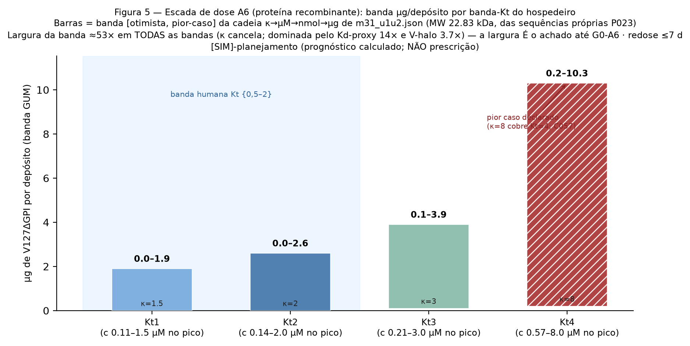

# COMPUTATIONAL ETRIZATION IN PRION DISEASES: APPLIED TO THE PrP-V127 THERAPEUTIC PLATFORM

**Unified thesis — EN companion** (chapter numbers follow the 13-chapter unified master; Parte 1 body: `manuscript_EN_v5.md` · Parte 2 body: `manuscript_Parte2_v1_EN.md` · this file mirrors the NEW unified-edition content: preamble, board note, shared-data chapter, the M3.1 dose section, reorganized limitations, conclusions. Claim-tags are exact-parity with the PT master; the registry (`claims.csv`) is natively EN.)

---

> ## NOTE TO THE READER — ON THE TERM *ETRIZATION*
>
> This document introduces the term **etrization** as an intentional compositional scientific neologism. The radical *etr-* evokes, by deliberate morphological extraction (not etymological derivation), the evolution *essere→estre→être* of the Indo-European root \*es- ('to be') — the **potential to become** — and the Latin *atrium* — the **antechamber** between the virtual and the real. **Etrization** names the state of knowledge this thesis produces and delivers: a system operationalized computationally from published real-world data, structurally robust and predictively informative, **not yet empirically validated** — and precisely for that reason able to ground the subsequent research that will actualize it. Just as 'atom' named, before proof, an object that founded science, 'etrization' names the process that produces operational concept-objects in health. The method that produces it, with its steps and guarantees, is the ACP (Methods chapter); the core technical operation is parameterization with provenance. Five criteria distinguish an etrization from mere simulation — explicit data chain, justified transposition, quantified uncertainty, delimited scope, conditioned transition — **all met and auditable in this thesis**. And as a mandate: all simulation here feeds exclusively on facts and data widely available in the published literature [claim:C054] [evidence:E009, E010, E007, E031, E032, E033].

## ABSTRACT (unified edition)

**Introduction.** Prion diseases are 100% fatal and six clinical candidates failed without a quantitative delivery model. Part 1 built, by systematic audit, transport physics, Bayesian calibration and humanized simulation, a therapeutic containment platform (PrP-V127) with the dimensionless threshold θ\*=0.333 — executed, approved and reproduced in two computational environments. **Objective.** This unified thesis formalizes and realizes continuity: it names the method (computational etrization, steps P0–P6), establishes the Validity Base with full data lineage, declares the thesis in analogous experimental form, delivers the [SIM] results as executed findings — now including the multi-species validation of θ\* (Part 3) and the first calculated dose of the discriminator arm A6 with propagated uncertainty — and documents future partner selection as a replicable method without executing it. **Method.** Etization P0–P6 over an E-registered base (58 verified sources), self-tested deterministic engines (mass conservation 100%; Thiele error 0.5%), harvest under pre-declared criteria, predictions locked by release before any measurement, a recursively gated guardian (R0–R3), and a dose chain κ→µM→µg/deposit in a Type-B GUM band with pre-registered acceptance criteria. **Results.** Threshold θ\*=0.333 [claim:C038] [evidence:E032]; three design rules; multi-species Scenario B (central θ\* 0.333–0.400; ratio 1.20) with the κ↔Kt titration rule [claim:C055, C057] [evidence:E032]; A6 dose band at the human rung: 0.0–2.6 µg V127ΔGPI per deposit (worst case κ=8: 0.2–10.3 µg; redose ≤7 d; MW 22.83 kDa from our own sequences) — the ≈53× band width is the finding, dominated by the Kd proxy, until arm G0-A6 closes it [claim:C058–C060] [evidence:E057, E058]; registry of 60 claims, 58 sources, 65 numeric facts with machine validation. **Conclusion.** The thesis is realized — **and it is an etrization**: delivered, labeled, auditable — continuing research by parameterized simulation without replacing the laboratory; if future real data are analogous to the simulated ones, the next steps are already advanced (staged anticipation).

---

# CHAPTER 1 — INTRODUCTORY NOTE TO THE BOARD

## 1.1 What the word is — and what it names that nothing else names

The operational definition is locked in the registry [claim:C054] [evidence:E009, E010, E007, E031, E032, E033]: **computational etrization** is the scientific investigation process in which a phenomenon or system is operationalized computationally from pre-existing real-world data (multiple sources and/or species), generating a structurally robust predictive model that, although not yet empirically validated, has sufficient conditions to ground subsequent research and, potentially, transition to experimental validation.

No existing term in health names **the ontological state of the product**: *in silico* is a method; *digital twin* replicates the already-real; *virtual patient* is a synthetic population; QSP/PBPK are disciplines; "proof of concept" presupposes empirical data. Health leaps from *hypothesis* to *experiment* without naming the middle — **structural potency validated mathematically from aggregated real data**. Etization names exactly that state: it allows saying *"this result is an etrization, not an experiment"* — one word carrying the entire disclaimer (not real; simulated; on real data; may become).

The three semantic layers of the radical *etr-* are declared as **intentional morphological consonance**, never etymological derivation: (i) the documented evolution *essere→estre→être*, evoking the root \*es- ("to be") and unactualized potency; (ii) the Roman *atrium* — antechamber between mathematical virtuality and experimental reality; (iii) the phonetic need for a distinctive terminological radical. Philological honesty is mandated: "deliberate morphological extraction / intentional compositional neologism" (precedent: *software*, *byte*, *quark*).

## 1.2 Structural differentiation (what the board should test)

**Against in-silico trials (IST):** IST **simulate the trial** — they reproduce on machine the design of a clinical experiment. Etization **simulates the continuation**: its product is a prognosis locked before measurement (predictions locked by public release v1.0 on 08/26, BEFORE Part 3 — auditable chronology), tier labels on every output, and staged anticipation (the derived research is already specified: what to measure, where, at what dose). An IST asks "would the trial have worked?"; etization asks "what can be known and decided NOW, from published data, without spending the trial?"

**Against systematic review/meta-analysis:** these **summarize** what was measured (backward synthesis). Etization **derives** (forward synthesis): it parameterizes an engine with published data and **produces new predictions** (θ\*=0.333; A6 dose band 0.0–2.6 µg/deposit) that none of the source papers contain — falsifiable by future data (G0-wet; arm A6).

**Against informal theoretical physics:** etization requires the five criteria (explicit data chain; justified transposition; quantified uncertainty — here as a GUM band; tier-delimited scope; gate-conditioned transition) — without them the term is empty; with them, it is a framework. This thesis is the first case meeting the standard the word now demands — auditable (hash-bound claims; guardian R0–R3; AST 9/9).

---

# CHAPTER 2 — SHARED DATA BASE (the bridge between foundation and application)

## 2.1 The same base under both modules

The multi-species foundation (Chapter 3) and the therapeutic design (Chapter 4) share, without exception: the **published murine kernel** [evidence:E009] (Igel/Fornara 2024, open code, ported with exact C0 parity); the **human clock anchors** [evidence:E007] (Groveman 2019: organoid, eclipse 25–28 dpi, de-novo production 35 dpi, MV2/MV1 titers); the **self-tested humanized engine** [evidence:E032] (WS-9: 1 simulation unit = 144 days; human doubling time 12.1 days); the **in-vivo human interstitial transport parameters** [evidence:E010] (Thorne & Nicholson 2006: α=0.20; λ=1.8); and our own **NCBI-verified PrP sequences** (P04156 and orthologs; BLOSUM62) — from which the dose's molecular weight was computed (22.83 kDa [evidence:E058]).

## 2.2 Honest chronology (the hostile examiner would ask — we answer first)

The therapeutic design (rules 1–3, θ\*=0.333, 8–12 mm ring) **was born BEFORE** the multi-species validation (Part 1, 08/24–27; predictions locked at release **v1.0 of 08/26**). Part 3 (08/30–09/01) **did not generate the design** — it **grounds the design's transfer and extends its dose rule**. The correct formulation:

> The design and the multi-species validation **share the same real-data base**. The validation demonstrates that the design's central quantity — θ\* — **survives species change** (Scenario B: 0.333–0.400 in central bands [claim:C055] [evidence:E032]) and **derives the κ_req↔Kt titration rule that generalizes the dose** to different kinetics [claim:C057] [evidence:E032]. Hence: validation is the **transfer-validity and dose-generalization layer** of the design — the application "emerges" from the foundation in the logical-pedagogical sense, with historical precedence declared (predictions locked BEFORE: anti-hindsight preserved and displayed as strength).

## 2.3 Validation table (all numbers from registry JSONs)

| Check | Value (registry) | Confrontation | Verdict |
|---|---|---|---|
| θ\*=0.333 (v1.0) ∈ multi-species central band? | Scenario B = **0.333–0.400** (mouse/human/hamster/vole) | the locked threshold is the band's **exact floor** [claim:C055] | ✅ consistent |
| Does the design dose (κ=2) cover humans? | human: κ_min=1.5 (Kt≤1) and **κ_min=2.0 (Kt=2)** | κ=2 = κ_min in the inherited hi-band | ✅ covers up to Kt≈2 (horizon caveat, §3.4) |
| Does titration extend the dose? | κ_req: Kt 1→1.5 · 2→2 · 3→3 · **4→8** (superlinear) | the design fixed κ=2; titration adjusts by kinetics [claim:C057] | ✅ genuine generalization |
| Does the sensitivity decomposition support the base? | only Kt moves containment and clock (Kr/Kc ≤3%) | per-species parameterization reduces to Kt (F-43) | ✅ |
| Pre-registered hamster prediction | REFUTED under definition P-024 (0.659 mm at κ=2/Kt=2) | reported as-is; horizon declared at every citation [claim:C056] | ✅ honesty displayed |

---

# CHAPTER 6.3 (EN) — THE FIRST CALCULATED DOSE: A6 DOSE BAND [SIM-planning]

**Dimensional chain (every cell with unit+source; canonical JSON `experiments/m31/m31_u1u2.json`):** κ_req (titration rule) → peak-deposit concentration c = κ_req × Kd → per-deposit amount n = c × V_halo → mass = n × MW. The apparent-Kd band is **0.071–1.0 µM** *(illustrative assumption; closed by arm A6)*: the floor, 71 nM, is the SPR-measured Kd for Aβ42 oligomers binding human PrP — **declared proxy**, since the V127↔PrP^Sc pair has no measured Kd; the ceiling, 1 µM, is Part 1 §2.2's illustrative anchor *(not a measured secretion estimate)*. The halo volume is a cylinder r×h with r₁₀%=4–6 mm and ECS fraction 0.15–0.25 (2 mm shell declared Type-B). The molecular weight is **22.83 kDa**, computed from our own P04156 sequences (residues 23–231, mature form; V127 is a same-mass variant, Δ=+14 Da). Chain sources: Kd-floor [evidence:E057] · V-halo [evidence:E030] · ECS [evidence:E010] · MW [evidence:E058] · titration [evidence:E032].

**Dose ladder by host Kt band:**

| Kt band | κ_req | peak c (µM) | µg V127ΔGPI/deposit | Redose |
|---|---|---|---|---|
| Kt 1 | 1.5 | 0.11–1.5 | 0.0–1.9 | ≤7 d |
| **Kt 2 (central human)** | **2** | **0.14–2.0** | **0.0–2.6** | **≤7 d** |
| Kt 3 | 3 | 0.21–3.0 | 0.1–3.9 | ≤7 d |
| Kt 4 (declared worst case) | 8 | 0.57–8.0 | 0.2–10.3 | ≤7 d |

At the human rung the A6 dose is **0.0–2.6 µg V127ΔGPI per deposit** (redose ≤7 d; rule 3) [claim:C058] [evidence:E057, E058, E032, E010, E030, E019]; the ladder rises monotonically with κ_req up to the declared worst case κ=8 (covering Kt=4): 0.2–10.3 µg/deposit [claim:C059] [evidence:E058, E032].

**The band width is the finding.** The worst/optimistic ratio is ≈**53× at every rung** — constant because κ_req cancels in the ratio: it decomposes into **14× from the Kd proxy** (71 nM → 1 µM; assumed illustrative) × **3.7× from the halo volume band** (4–6 mm; ECS 0.15–0.25) [claim:C060] [evidence:E057, E058, E010, E030]. This is not a calculation defect: it is the **honest quantification of what trial G0-A6 closes** — the recombinant-protein arm at known dose converts the κ↔µM anchor from illustrative to measured, collapsing the band to a point. Until then, the dose exists as a band, and the band is [SIM] planning: calculated prognosis, **not a prescription**.

*Figure 5 (auditable: `experiments/m31/make_fig5_doseladder.py` reads only `m31_u1u2.json`; CI-regenerable). Bars = [optimistic, worst-case] band; hatched = declared worst case κ=8 (C057); blue span = human band Kt {0.5–2}; width ≈53× constant (κ cancels) — the width IS the finding until G0-A6. [SIM]-planning tier in the figure title.*

**Why A6 is the primary dose vector:** dose units differ by vector (A5 = cells+secretor; A7 = µg mRNA); only A6 (recombinant protein) has a **knowable output dose**. It is the discriminator arm: it closes the κ↔µM link *(illustrative assumption; closed by arm A6)* and tests the capping functional form (first power vs quadratic, locked at Part 1's [SIM] harvest) [claim:C051] [evidence:E032, E033]. A5 and A7 inherit the chain as derivatives.

---

# CHAPTER 12 (EN, reorganized) — LIMITATIONS AS FRUIT

Full English limitation list (15 items): full list: `manuscript_EN_v5.md` §Limitations; chapter mapping per the 13-chapter PT master — reorganized here by class, each with the gate that closes it: transfer (murine→human closed structurally by Scenario B, in measure by G0-wet; κ↔µM proxy **quantified by the ≈53× band** [claim:C060], closed by arm A6) · horizon (θ\* horizon-dependent; definition declared at every citation [claim:C056]) · model-structure (grid-corner escapes = lower bound, finer grid pre-declared; species reduces to Kt band; capping functional form falsifiable by A6 [claim:C051]) · monitored sources (preprints; retracted trial excluded by rule [claim:C024]) · execution (single-rater partner weights; co-rating pre-declared) · localization (E200K-Brazil compassionate route specified, not promised).

# CHAPTER 13 (EN) — CONCLUSIONS BY OBJECTIVE

**OE1** (name and formalize etrization) — achieved: P0–P6 with per-step guarantees; board note differentiates from IST and meta-analysis [claim:C054]. **OE2** (Validity Base) — achieved: triad + full lineage (now 7 lines, including the κ-concentration anchor band) [claim:C046]. **OE3** (results as [SIM] findings) — achieved: threshold; rules 1–3; discriminating sensitivity; probabilistic frame; boundary-calibrated estimator; derived decision-table; multi-species validation; **and the first calculated dose with propagated uncertainty** — the A6 band (0.0–2.6 µg/deposit at the human rung; width ≈53× = what G0-A6 closes) converts Part 3's dose rule into a mass prognosis [claim:C038, C051, C052, C055–C060]. **OE4** (continuity documented as method) — achieved [claim:C053]. **OE5** (hostile review + expressed validation) — achieved: R0–R3 two profiles 0 BLOCKED; AST 9/9; registry 60 claims · 58 sources · 65 numeric facts.

**Final synthesis.** This thesis is an **etrization** — realized, labeled, auditable. **Epistemic closing:** what can a researcher legitimately produce when the disease kills in months, the laboratory costs fortunes, and published data are available? **Quantitative, falsifiable, criteria-disciplined prognosis** — with a name (etrization), a method (P0–P6), guarantees (5 requirements) and honesty about what it is and is not. As the atom made the invisible researchable, etrization makes the not-yet-measured researchable.
